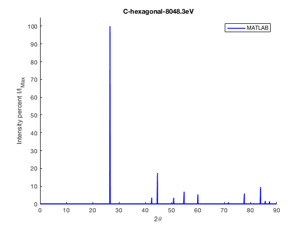
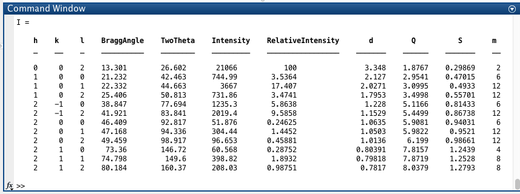
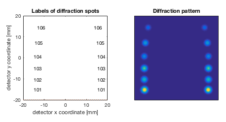
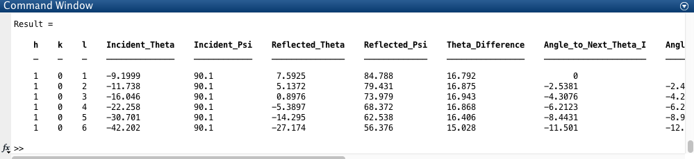
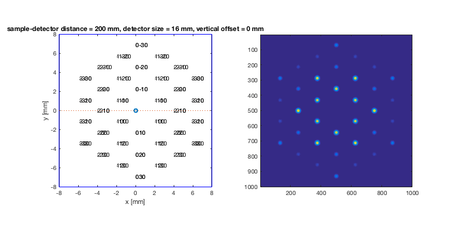
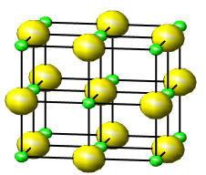

# A Quick Introduction to the Diffraction Library

The diffraction library is a collection of MATLAB scripts for the modeling of various diffraction geometries for diffraction of x-rays or electrons from crystals. The library was developed with the Ultrafast Science community in mind, with an emphasis on ease of customization and use. This Quick Intro is targeted towards experienced MATLAB users who wish to quickly learn the key functionalities of the library. It is not intended as an expansive documentation of the library. Further information and examples may be found in the help feature of the respective scripts. The examples below use graphite as the template crystal to showcase the capabilities of the library.

## Build lattice structure

The library currently offers several diffraction scripts corresponding to various diffraction geometries. The minimum neccessary to run a diffraction script is a properly defined lattice structure and a probe (x-rays or electrons). A lattice is constructed by defining the molecular symbol, the lattice system type, the corresponding lattice constants, and the positions of atoms in the lattice (in the reference frame of the lattice system coordinate). The following example shows how to define graphite:

```matlab
>> Lattice.Symbol = 'C';   
>> Lattice.Type = 'hexagonal'; 
>> Lattice.a = 2.4560;
>> Lattice.c = 6.6960;
>> Lattice.AtomicPositions = [0 0 0 ; 0 0 1/2 ; 1/3 2/3 0 ; 2/3 1/3 1/2];
```

Once defined, the user can save the Lattice structure as a MATLAB file so as not to have to redefine it again in the future. This is done by using the save commad in MATLAB:

```matlab
>> save('graphite_hexagonal.mat', 'Lattice'); 
```
All other Lattice properties, if not defined in the structure file, are automatically calculated by the library (e.g. lattice volume, density, etc).

## Define probe

The probe is the incident beam. It may currently be defined as either 'xrays' or 'electrons', along with its Energy (in eV). For non-coplanar diffraction, there are additional parameters on the geometry of the incident beam (to be described later). For powder diffraction, only two parameters are required as shown here:

```matlab
>> Probe.Type = 'xrays';
>> Probe.Energy = 8048.3;
```

## Generate powder diffraction profile

With 'Lattice' and 'Probe' defined, one can now run the powder diffraction simulation with the above inputs via the MATLAB command-line:

```matlab
>> Generate_Intensity_2theta(Lattice, Probe);
```



This outputs two figures. The first, shown above, is an Intensity vs 2*Theta plot for the given parameters. The second (not shown) is a scatter plot lacking the multiplicity term as to see the individual contributions of a single plane in contrast to the summation of the family of planes.

This also outputs a table to the command window showcasing the desired diffraction information such as the relative intensity, the diffraction angle, and the d-spacing. For the sake of space, the table below is over the hkl range [-2:2]:



In addition, the table may also be outputted as a .txt, .xlsx, .xls, .dat, or .csv depending on the end user's preference. 

## Simulate non-coplanar diffraction from crystals with preferred orientation

The library is capable of simulating geometrical patterns such as the one shown below for grazing incidence x-ray diffraction off a crystal. Here, one sees both the brightness and position of the possible diffraction pattern over a range of miller indices given the detector parameters below for a HOPG graphite crystal with a 001 normal.

Additional Inputs:

```matlab
>> Lattice.Normal = [0 0 1]

>> Probe.DiffractionGeometry = 'noncoplanar'
>> Probe.psi = 0.1

>> Detector.Shape = 'square' %May be square or circle
>> Detector.Size = 40 %In mm
>> Detector.SpotFWHMx = 2
>> Detector.SpotFWHMy = 2
>> Detector.DistanceToSample = 50 
>> Detector.Offset = [0 20]
```



## Calculate exit angles for non-coplanar diffraction from single-crystals

This also outputs a table to the command window showcasing the desired diffraction information such as the incident and reflected thetas' and psis' in cartesian coordinates, and the calculated angle neccessary to rotate the sample from one peak to another. For the sake of space, a snippet of the table for a miller indice range [0:6] is shown below:



## Simulate diffraction pattern in Transmission Election Microscopy.

The library is capable of simulating geometrical patterns such as the one shown below for TEM diffraction off a crystal. This uses mostly the same parameters from the non-coplanar example.

Most notably, the probe structure once again only requires two variables, Type and Energy:

```matlab
>> Lattice.Normal = [0 0 1];

>> Probe.Type = 'electrons'
>> Probe.Energy = 60000;
```

Electrons scatter at much smaller angles than xrays and the detector parameters must be adjusted accordingly:
```matlab
>> Detector.Shape = 'square' 
>> Detector.Size = 16  
>> Detector.SpotFWHMx = 0.3
>> Detector.SpotFWHMy = 0.3
>> Detector.DistanceToSample = 200 
>> Detector.Offset = [0 0]
```



## Visualize the lattice structure
As a diagnostic tool, one may also generates a 3D rendering of an inputted lattice structure such as the one shown below for a sodium cloride crystal. 



Note: The model shown above was generated using the script Diffraction/VisualizeCrystal.m

