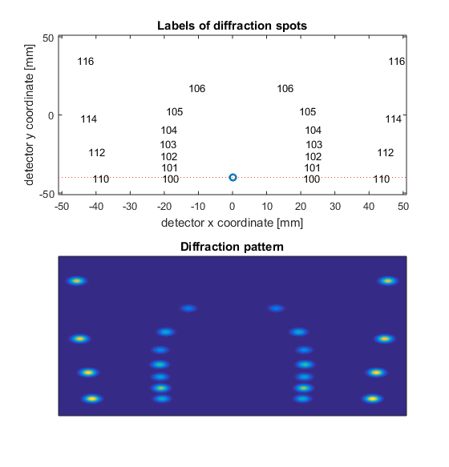

# Diffraction
Collection of MATLAB scripts for modeling of interaction between crystals and x-rays or electrons. Developed with the Ultrafast Science community in mind. Among the main capabilities of the scripts:

- Calculating basic properties of crystals such as planar distances, scattering vectors, geometrical structure factors, etc.

- Modeling of various diffraction geometries such as coplanar symmetric diffraction, coplanar asymmetric diffraction, and non-coplanar diffraction.

- Simulating geometrical diffraction patterns such as the one shown below for grazing incidence x-ray diffraction off a graphite crystal. 

Note: The simulation shown above was generated using the script TestScripts/Graphite_GeometricalSimulation_noncoplanar.m 
